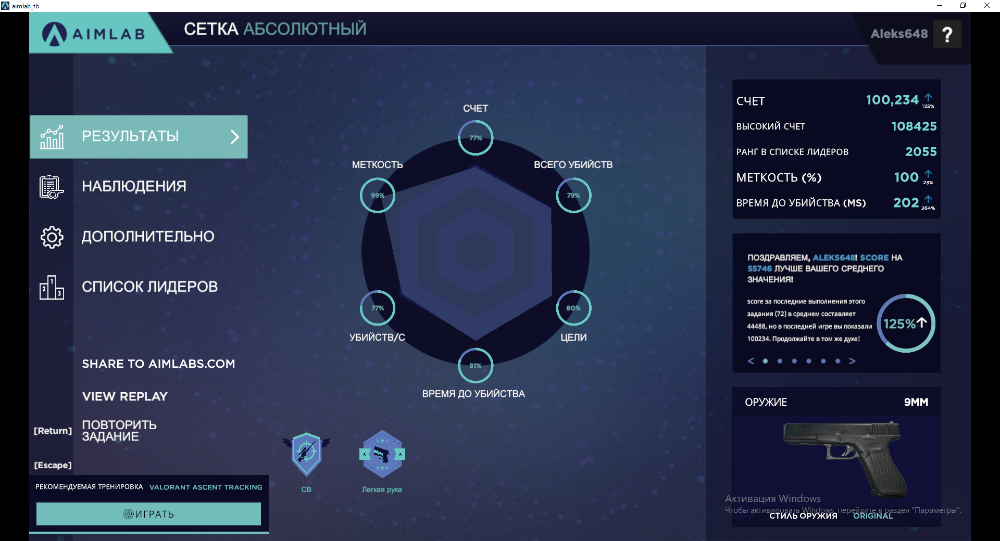
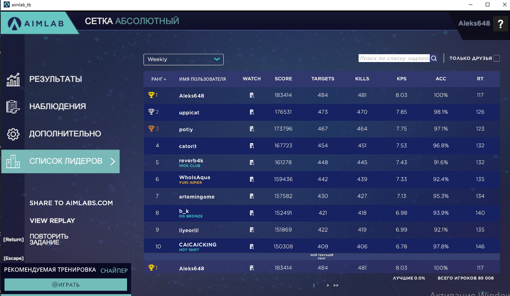
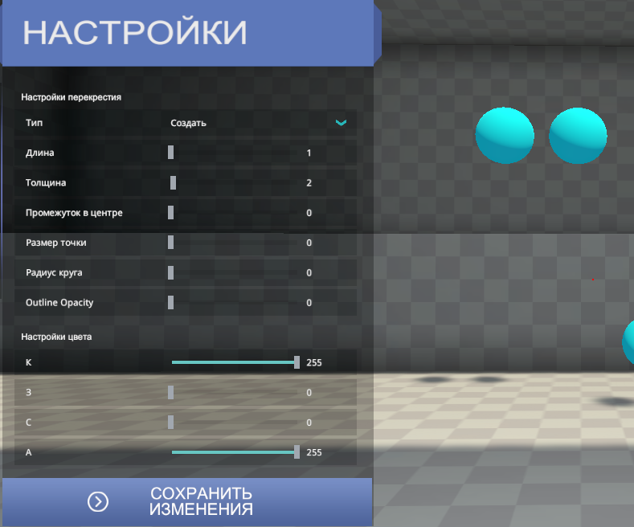
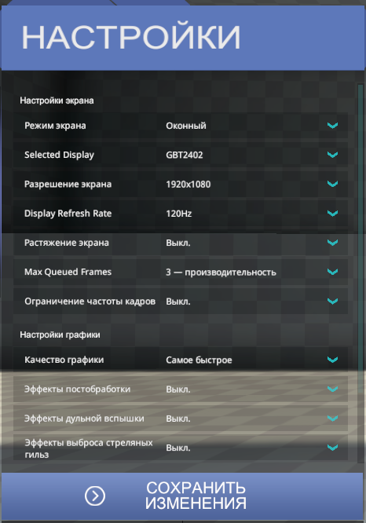
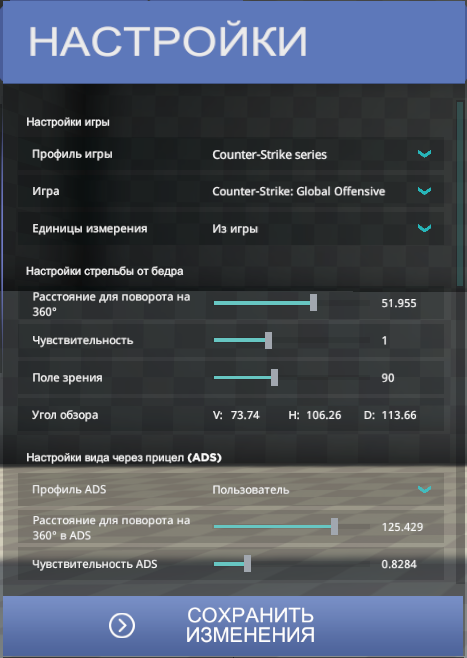

# 🤖 Aim Lab bot
Aim Lab computer vision bot made as an experiment (using OpenCV masks).

# How to setting
1. windows text size 100%
2. sensetive in aimlab 1
3. windowed aimlab
4. find x360 = 8182 * 2, press move_left, move_right until you find a value that will rotate your crosshair exactly 180 degrees
5. replace this value in code, replace fov in code

# How to use
1. open aimlab
2. select grid absolute map (сетка абсолютная)
3. change body color for arm
4. run python script
5. start train in aimlab
6. press CAPS LOOK

# How it work
open conspects folder for detail
1. grabber make screenshot of aimlab
2. get sphere color (hue_point)
3. create mask (black-white image) for this color
4. get contours of white shapes (rectangles for sphere)
5. union near shapes  (NMS, join intersections)
6. find nearest contour to aim 
7. red dot in center of nearest contour
8. get move angle to mouse
9. move mouse
10. check right move
11. if right click (shot)
12. repeat

# Result

# Settings screenshots

# Origins
[Tutorial](https://www.youtube.com/watch?v=cJbvPGCqW8s)
[Github](https://github.com/Priler/aimlabbot)
